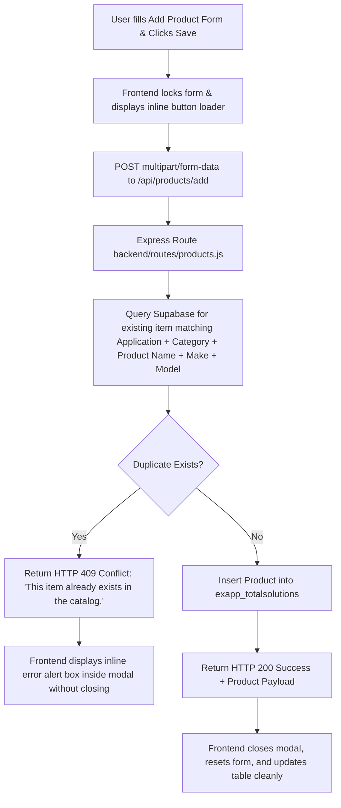

# Implementation Plan - Optimizing Add Item & Duplicate Validation

**User Spec**: [`spec.md`](spec.md)
**Feature Branch**: `005-optimizing-add-item`

## Technical Architecture

## Proposed Changes

### Backend Route (`backend/routes/products.js`)

1. **Duplicate Pre-check in `POST /api/products/add`**:
   - Query `exapp_totalsolutions` with `.ilike('application', ...)` `.ilike('category', ...)` `.ilike('product_name', ...)` `.ilike('make', ...)` `.ilike('model', ...)`.
   - If a record is found, return HTTP 409: `{ status: 'error', message: 'This item already exists in the catalog.' }`.

2. **Database Insert**:
   - Save item cleanly if no duplicate exists.

### Frontend Modal (`frontend/src/pages/Ratecard.jsx`)

1. **State Management**:
   - `isSubmittingAdd`: Locks submit buttons and disables form inputs while saving.
   - `addModalError`: Displays styled inline warning alert box inside the modal if duplicate error or validation failure occurs.

## Verification & Testing Plan

1. **Duplicate Test**:
   - Fill form with existing item attributes (e.g. `Application: Parking Access Control`, `Category: hardware`, `Product Name: Boom Barrier`, `Make: Magnetic`, `Model: Access PRO RA3500`).
   - Verify modal remains open with warning *"This item already exists in the catalog."*
2. **Unique Product Test**:
   - Fill form with unique product attributes.
   - Verify smooth save, modal reset, and immediate table update.
