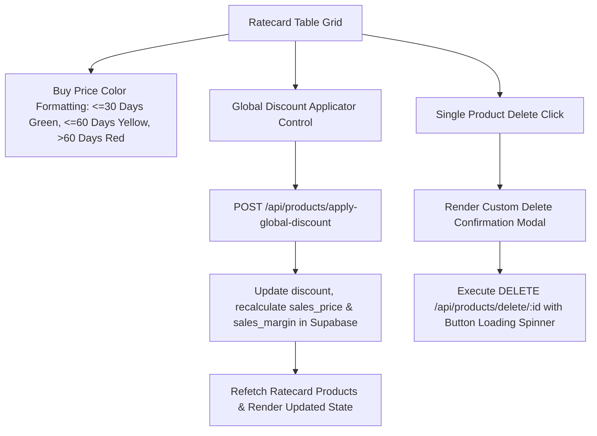

# Implementation Plan - Total Solution Table Optimization & Global Discount

**User Spec**: [`spec.md`](spec.md)
**Feature Branch**: `007-total-solution-table-optimization`

## Technical Architecture

## Proposed Changes

### Backend Infrastructure (`backend/routes/products.js`)

1. **Refined Buy Price Color Age Thresholds**:
   - $\le 30$ days: `green`
   - $31\text{--}60$ days: `yellow`
   - $> 60$ days / null: `red`

2. **Bulk Discount Endpoint (`POST /api/products/apply-global-discount`)**:
   - Updates `discount` percentage for catalog items.
   - Recalculates `sales_price = Math.max(list_price - (list_price * discount / 100), 0)` and `sales_margin = sales_price > 0 ? Math.round(((sales_price - buying_price) / sales_price) * 100) : 0`.

### Frontend Component (`frontend/src/pages/Ratecard.jsx`)

1. **Global Bulk Discount Control Panel**:
   - Render input & action button in filter panel to apply portfolio-wide discount rates seamlessly.

2. **Custom Single Item Delete Confirmation Modal**:
   - Replace native `window.confirm` with a React modal component featuring lock protection and action loading spinner.

## Verification & Testing Plan

1. **Buy Price Color Test**:
   - Inspect products with varying quotation dates and confirm color badges match age thresholds.
2. **Bulk Discount Test**:
   - Enter a percentage (e.g. 15%) in the global discount bar, click "Apply to All", and verify grid updates.
3. **Custom Delete Modal Test**:
   - Click trash icon, confirm modal displays product title, and verify smooth deletion.
