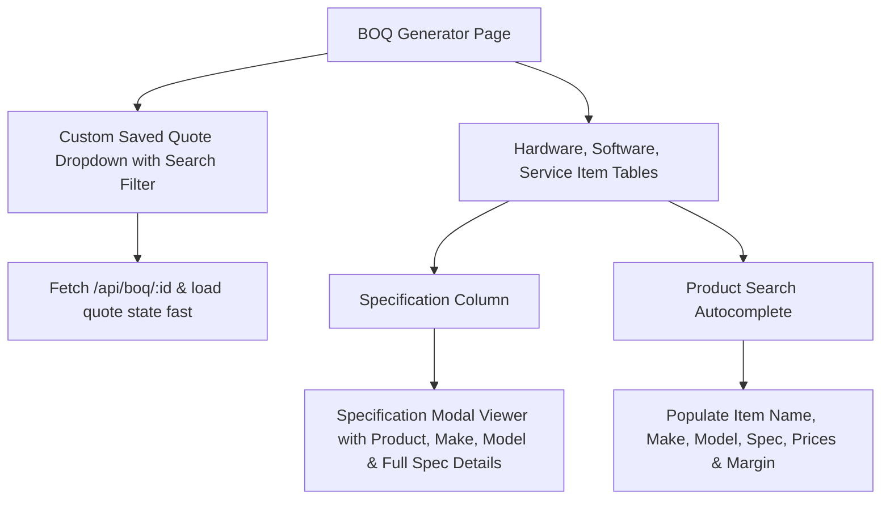

# Implementation Plan - BOQ Generator Optimization & Specification Viewer

**User Spec**: [`spec.md`](spec.md)
**Feature Branch**: `008-boq-optimization`

## Technical Architecture

## Proposed Changes

### Frontend Component (`frontend/src/pages/BOQGenerator.jsx`)

1. **Custom Saved BOQ Dropdown Component**:
   - Searchable, interactive dropdown component featuring search filter input, quote numbers, and project location badges.
   - Replaced native `<select>` element.

2. **Specification Column & Popup Modal**:
   - Added **Specification** column to Hardware, Software, and Service tables.
   - Clickable `FileText` icon launches a modern Modal displaying product title, Make/Model subtitle, and complete specification details.

3. **Search Autocomplete & Table Layout Polish**:
   - Expanded column alignment, item field mapping, and responsive table overflow.

## Verification & Testing Plan

1. **Saved Quote Search Test**:
   - Click "Load Quote" dropdown, filter by project name, and verify instant quote loading.
2. **Specification Modal Test**:
   - Click the specification icon on any item row and verify that complete specification text displays inside the modal.
3. **Build Test**:
   - Run `npx vite build` to confirm clean production React compilation.
