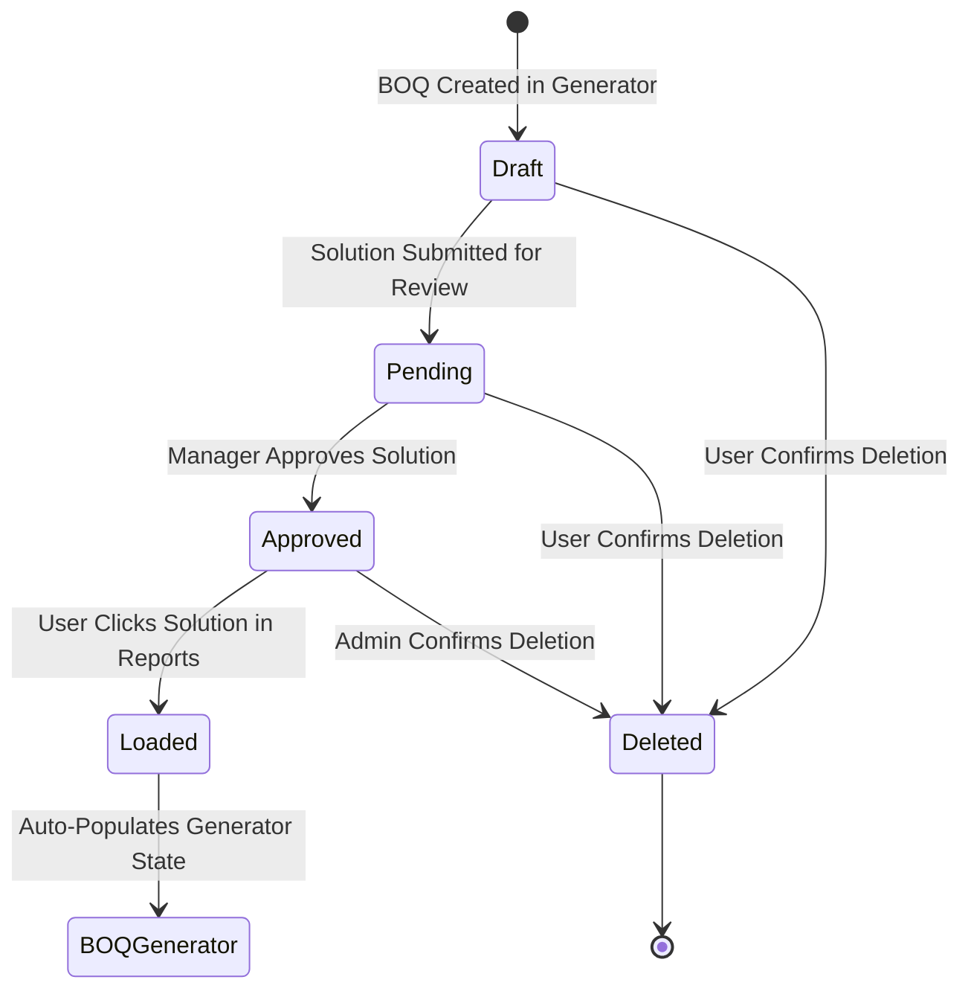

# Data Model: Report Optimization & Solution Management

## Entity Definitions

### 1. BOQ Report Summary (`exapp_boq` row extension)

| Field Name | Type | DB Column / JSON Property | Description |
|---|---|---|---|
| `id` | `Integer` | `id` (PK) | Unique quote/solution record ID |
| `projectName` | `String` | `project_name` | Name of the project/client |
| `projectLocation` | `String` | `project_location` | Location of project installation |
| `quotationNumber` | `String` | `quotation_number` | Formal quote identifier (e.g. `BOSCH-2026-009`) |
| `approach` | `String` | `approach` | Purchase channel (`'si'` for SI, `'direct'` for Direct Purchase) |
| `solutionTitle` | `String` | `solution_title` | Title/description of the solution architecture |
| `preparedBy` | `String` | `prepared_by` | Username of the sales engineer who authored the quote |
| `approvalStatus` | `String` | `approval_status` | Status of solution approval (`'Pending'`, `'Approved'`) |
| `usageCount` | `Integer` | `usage_count` | Number of times this solution was selected/loaded |
| `isPriority` | `Boolean` | `is_priority` | Flag indicating high-priority deal status |
| `hardware` | `Array<Object>` | `hardware` (JSON) | Hardware line items array |
| `software` | `Array<Object>` | `software` (JSON) | Software line items array |
| `services` | `Array<Object>` | `services` (JSON) | Service line items array |
| `totals` | `Object` | `totals` (JSON) | Summary totals (`grandTotalSales`, `grandTotalBuy`, margins) |
| `createdAt` | `Timestamp` | `created_at` | Quote creation date/time |

---

### 2. Frontend Report Filter State

```typescript
interface ReportFilterState {
  searchQuery: string;               // Keyword search across project, quote #, solution, client
  purchaseChannel: 'all' | 'si' | 'direct'; // Channel filter selection
  sortBy: 'date' | 'value' | 'usage'; // Sorting option
  showHighPriorityOnly: boolean;     // Filter toggle for priority projects
}
```

---

### 3. Frontend Computed Solution Card Model

```typescript
interface ComputedSolutionReportItem {
  id: number;
  projectName: string;
  projectLocation: string;
  quotationNumber: string;
  approach: 'si' | 'direct';
  solutionTitle: string;
  preparedBy: string;
  approvalStatus: 'Pending' | 'Approved';
  usageCount: number;
  grandTotalSales: number;
  grandTotalBuy: number;
  profitMargin: number;
  isHighValue: boolean;    // True if sales total >= 1,000,000 or top 20%
  isHighPriority: boolean; // Explicit or rule-based high priority
  isMostUsed: boolean;     // True if usageCount matches maximum across active dataset
  createdAt: string;
}
```

---

## State Transitions


