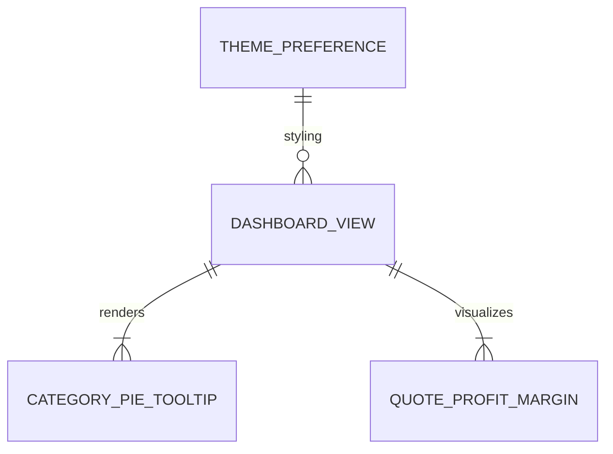

# Data Model: Dashboard Optimization

**Feature**: `010-dashboard-optimization`  
**Date**: 2026-08-04  
**Status**: Complete

## Entity Definitions

### 1. ThemePreference (UI State Entity)

Represents user appearance preference stored locally and managed via `ThemeContext`.

| Attribute | Type | Description | Constraints |
|-----------|------|-------------|-------------|
| `theme` | String | Active theme mode | Enum: `'light'` \| `'dark'`. Default: `'light'` |
| `toggleTheme` | Function | Handler to toggle mode | Mutates state and updates `localStorage` |

**State Transitions**:
- `light` $\rightarrow$ `toggleTheme()` $\rightarrow$ `dark` (Appends `.dark` class to `<html>`, stores `'dark'` in `localStorage`)
- `dark` $\rightarrow$ `toggleTheme()` $\rightarrow$ `light` (Removes `.dark` class from `<html>`, stores `'light'` in `localStorage`)

---

### 2. CategoryPieTooltipData (View Entity)

Structured payload passed to the Category Breakdown pie chart custom tooltip handler.

| Attribute | Type | Description |
|-----------|------|-------------|
| `name` | String | Category label (e.g. `'Software'`, `'Hardware'`, `'Service'`) |
| `value` | Number | Integer count of items in category |
| `color` | String | Hex color code associated with category slice |
| `total` | Number | Sum of all category item values |
| `percentage` | Number | Calculated share $\frac{\text{value}}{\text{total}} \times 100$ |

---

### 3. QuoteProfitMargin (Domain Entity)

Metric entity representing profitability data for each quoted solution/project rendered on the Profit Margin Comparison chart.

| Attribute | Type | Description |
|-----------|------|-------------|
| `id` | String / Number | Unique identifier for quote/project |
| `quoteName` | String | Display title of quote / customer project |
| `totalSellingPrice` | Number | Total quoted price in system currency |
| `totalCost` | Number | Aggregated cost price for BOQ items |
| `profitMarginAmount` | Number | Gross margin $\text{Selling Price} - \text{Cost}$ |
| `profitMarginPercentage` | Number | Margin percentage $\frac{\text{Margin Amount}}{\text{Selling Price}} \times 100$ |
| `status` | String | Status of quote (e.g. `'Draft'`, `'Submitted'`, `'Approved'`) |

---

## Entity Relationships

