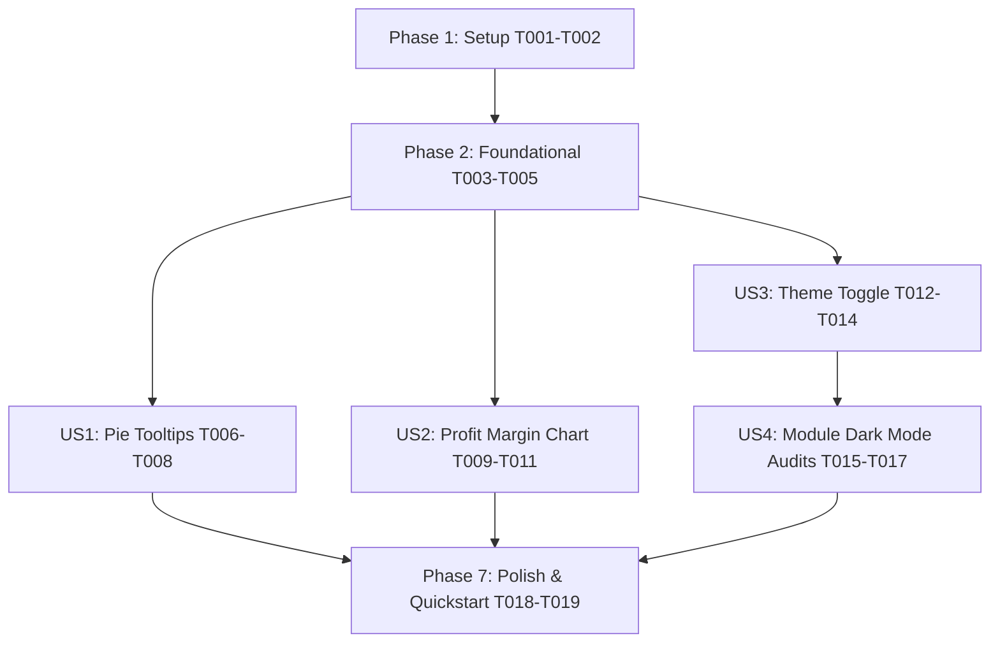

# Tasks: Dashboard Optimization

**Input**: Design documents from `specs/010-dashboard-optimization/`  
**Prerequisites**: plan.md (required), spec.md (required), research.md, data-model.md, contracts/, quickstart.md  
**Organization**: Grouped by user story for independent implementation and testing.

## Format: `[ID] [P?] [Story] Description`

- **[P]**: Can run in parallel (different files, no dependencies)
- **[Story]**: User story mapping (e.g. [US1], [US2], [US3], [US4])

---

## Phase 1: Setup (Shared Infrastructure)

**Purpose**: Tailwind CSS dark mode configuration and global theme CSS variables

- [x] T001 Configure Tailwind CSS dark mode setting (`darkMode: 'class'`) in `frontend/tailwind.config.js`
- [x] T002 Add theme CSS root variables and background surface tokens in `frontend/src/index.css`

---

## Phase 2: Foundational (Blocking Prerequisites)

**Purpose**: Theme Context and Theme Provider infrastructure required for global theme toggling

**⚠️ CRITICAL**: Must be completed before theme toggle UI can be integrated across pages

- [x] T003 [P] Create `ThemeContext` and `ThemeProvider` component with `localStorage` persistence in `frontend/src/context/ThemeContext.jsx`
- [x] T004 [P] Wrap application layout in `ThemeProvider` within `frontend/src/App.jsx`
- [x] T005 [P] Create `ThemeToggle` icon button component in `frontend/src/components/ThemeToggle.jsx`

**Checkpoint**: Foundation ready - Theme Context is available application-wide.

---

## Phase 3: User Story 1 - Interactive Category Breakdown Chart Tooltips (Priority: P1) 🎯 MVP

**Goal**: Display exact item counts and percentage shares on hover over Category Breakdown pie chart slices.

**Independent Test**: Navigate to `/`, hover cursor over each pie chart slice, verify custom popover tooltip displaying category name, count, and share %.

### Implementation for User Story 1

- [x] T006 [P] [US1] Create custom Recharts `PieTooltip` popover component with high-contrast formatting in `frontend/src/pages/Dashboard.jsx`
- [x] T007 [US1] Calculate total items and category percentage shares dynamically within Category Breakdown `PieChart` in `frontend/src/pages/Dashboard.jsx`
- [x] T008 [US1] Apply theme-adaptive text contrast and border styling to Category Breakdown tooltips and legends in `frontend/src/pages/Dashboard.jsx`

**Checkpoint**: User Story 1 complete and testable independently.

---

## Phase 4: User Story 2 - Quote Profit Margin Comparison Chart (Priority: P1)

**Goal**: Replace legacy Volume Comparison graph with a Profit Margin Comparison chart for quoted projects.

**Independent Test**: Navigate to `/`, verify second chart card displays Profit Margin Comparison graph with quote labels, margin percentages, and hover tooltips.

### Implementation for User Story 2

- [x] T009 [P] [US2] Implement quote profit margin data calculation and fetch logic in `frontend/src/pages/Dashboard.jsx`
- [x] T010 [US2] Replace Volume Comparison bar chart card layout with Profit Margin Comparison `BarChart` in `frontend/src/pages/Dashboard.jsx`
- [x] T011 [US2] Add custom margin color indicators and detailed quote financial tooltips in `frontend/src/pages/Dashboard.jsx`

**Checkpoint**: User Story 2 complete and testable independently.

---

## Phase 5: User Story 3 - Global Theme Appearance Toggle (Dark / Light Mode) (Priority: P2)

**Goal**: Add theme toggle button in header allowing seamless switching between Dark Mode and Light Mode.

**Independent Test**: Click Sun/Moon button in top navigation bar, observe immediate recoloring of cards/backgrounds, reload page and verify theme preference persists.

### Implementation for User Story 3

- [x] T012 [P] [US3] Integrate `ThemeToggle` button into top navigation header in `frontend/src/App.jsx`
- [x] T013 [P] [US3] Update sidebar navigation layout for dark theme styling in `frontend/src/components/Sidebar.jsx`
- [x] T014 [US3] Adapt dashboard summary metrics cards and chart card backgrounds for `.dark` theme classes in `frontend/src/pages/Dashboard.jsx`

**Checkpoint**: User Story 3 complete and testable independently.

---

## Phase 6: User Story 4 - Regression Prevention & Dashboard Stability (Priority: P3)

**Goal**: Ensure all existing CRM modules (Ratecard, BOQ Generator, Reports) render cleanly in both theme modes without functional regressions.

**Independent Test**: Perform standard operations on Ratecard, BOQ Generator, and Reports pages in both Light and Dark modes.

### Implementation for User Story 4

- [x] T015 [P] [US4] Audit and update Ratecard page layout for dark mode compatibility in `frontend/src/pages/Ratecard.jsx`
- [x] T016 [P] [US4] Audit and update BOQ Generator page layout for dark mode compatibility in `frontend/src/pages/BOQGenerator.jsx`
- [x] T017 [P] [US4] Audit and update Reports page layout for dark mode compatibility in `frontend/src/pages/Reports.jsx`

**Checkpoint**: All user stories functional and visually integrated.

---

## Phase 7: Polish & Cross-Cutting Concerns

**Purpose**: Final validation and visual polish

- [x] T018 [P] Run all quickstart validation scenarios from `specs/010-dashboard-optimization/quickstart.md`
- [x] T019 Verify smooth visual transitions, chart contrast, and zero browser console errors during theme toggles

---

## Dependencies & Execution Order

### Parallel Opportunities

- **Setup & Foundational**: T003, T004, T005 can be implemented concurrently once T001-T002 complete.
- **User Stories 1 & 2**: US1 (T006-T008) and US2 (T009-T011) target distinct chart sections in `Dashboard.jsx` and can proceed in parallel.
- **User Story 4 Audits**: T015 (Ratecard), T016 (BOQGenerator), and T017 (Reports) target separate files and can run completely in parallel.

---

## Implementation Strategy

### MVP Scope (User Stories 1 & 2 First)
1. Complete Setup (T001-T002) + Foundational Theme Context (T003-T005).
2. Complete US1 (Category Breakdown pie chart hover tooltips).
3. Complete US2 (Profit Margin Comparison chart replacement).
4. Validate dashboard charts independently.

### Incremental Delivery
1. Deliver US1 & US2 for core dashboard optimization.
2. Deliver US3 for header theme toggle and dashboard dark mode.
3. Deliver US4 for full CRM application dark mode coverage across Ratecard, BOQ, and Reports.
