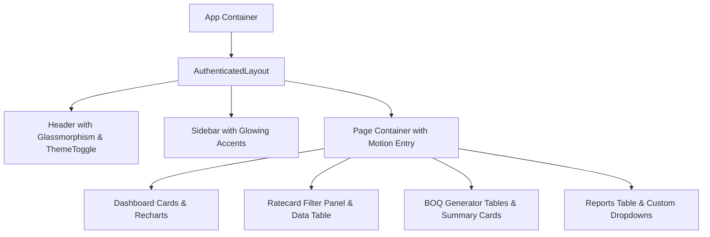

# Data Model: Modern Layout Optimization

**Feature**: `011-modern-layout-optimization`  
**Date**: 2026-08-04  
**Status**: Complete

## UI Layout Tokens & Motion Entities

### 1. MotionPreset (Animation Config Entity)

Represents standardized Framer Motion variants used across page containers, modal dialogs, and cards.

| Attribute | Type | Values / Preset | Description |
|-----------|------|-----------------|-------------|
| `pageFade` | Variant | `{ initial: { opacity: 0, y: 15 }, animate: { opacity: 1, y: 0 } }` | Smooth entry transition for main views |
| `cardHover` | Variant | `{ whileHover: { y: -4 }, transition: { duration: 0.2 } }` | Hover elevation effect for dashboard & summary cards |
| `modalPop` | Variant | `{ initial: { opacity: 0, scale: 0.95 }, animate: { opacity: 1, scale: 1 } }` | Popup animation for dialogs and modals |
| `buttonPress` | Variant | `{ whileTap: { scale: 0.97 } }` | Active click tactile feedback |

---

### 2. SurfaceToken (Styling Entity)

Defines class mappings for light and dark theme UI components.

| Component Surface | Light Mode Utility Classes | Dark Mode Utility Classes |
|------------------|---------------------------|---------------------------|
| Page Wrapper | `bg-slate-50 text-slate-800` | `dark:bg-slate-950 dark:text-slate-100` |
| Primary Card | `bg-white border-slate-200/80 shadow-premium` | `dark:bg-slate-900 dark:border-slate-800` |
| Glass Panel | `bg-white/70 backdrop-blur-md border-white/30` | `dark:bg-slate-900/80 dark:backdrop-blur-md dark:border-slate-800/80` |
| Primary Button | `bg-bosch-blue hover:bg-bosch-lightBlue text-white` | `bg-bosch-blue hover:bg-bosch-lightBlue text-white shadow-lg shadow-bosch-blue/20` |
| Category Badge | `bg-slate-100 text-slate-700` | `dark:bg-slate-800 dark:text-slate-300` |

---

## Component Layout Architecture

