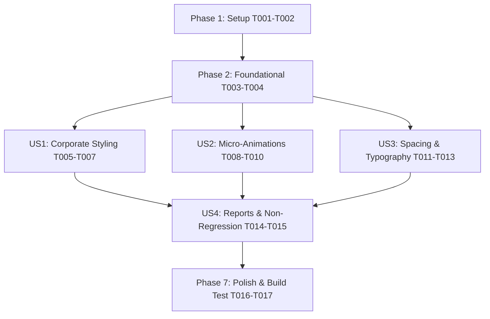

# Tasks: Modern Layout Optimization

**Input**: Design documents from `specs/011-modern-layout-optimization/`  
**Prerequisites**: plan.md (required), spec.md (required), research.md, data-model.md, contracts/, quickstart.md  
**Organization**: Grouped by user story for independent implementation and testing.

## Format: `[ID] [P?] [Story] Description`

- **[P]**: Can run in parallel (different files, no dependencies)
- **[Story]**: User story mapping (e.g. [US1], [US2], [US3], [US4])

---

## Phase 1: Setup (Shared Infrastructure)

**Purpose**: Design system tokens, glassmorphism utility classes, and custom shadow depths

- [x] T001 Configure glassmorphism CSS utilities, dark glass panels, and scrollbars in `frontend/src/index.css`
- [x] T002 Add surface tokens, custom shadows (`shadow-premium`), and color variables in `frontend/tailwind.config.js`

---

## Phase 2: Foundational (Blocking Prerequisites)

**Purpose**: Core application layout wrapper and navigation sidebar modernization

**⚠️ CRITICAL**: Must be completed before page-level layout modernizations begin

- [x] T003 [P] Update `AuthenticatedLayout` in `frontend/src/App.jsx` with glassmorphism header, backdrop blur, and responsive grid containers
- [x] T004 [P] Enhance `Sidebar.jsx` with active route glowing indicators, corporate gradient accent bars, and smooth collapse transitions in `frontend/src/components/Sidebar.jsx`

**Checkpoint**: Foundation ready - Modern header and sidebar navigation established.

---

## Phase 3: User Story 1 - Modern Corporate Aesthetics & Harmonious Color Palette (Priority: P1) 🎯 MVP

**Goal**: Apply modern corporate styling, glassmorphism panels, and refined card containers across primary views.

**Independent Test**: Navigate across `/`, `/ratecard`, `/boq`, `/reports`, `/login` and verify glassmorphism surfaces and dark/light mode contrast.

### Implementation for User Story 1

- [x] T005 [P] [US1] Apply glassmorphism panel styles and corporate gradient banners to `frontend/src/pages/Dashboard.jsx`
- [x] T006 [P] [US1] Modernize `Login.jsx` card container with glassmorphism backdrop blur and shadow depth in `frontend/src/pages/Login.jsx`
- [x] T007 [US1] Update summary metric cards and chart card containers in `frontend/src/pages/Dashboard.jsx`

**Checkpoint**: User Story 1 complete and testable independently.

---

## Phase 4: User Story 2 - Micro-Animations & Fluid Interaction Effects (Priority: P1)

**Goal**: Integrate Framer Motion variants for card hover lifts, page entry fades, tactile button press effects, and modal popups.

**Independent Test**: Hover metric cards, click action buttons, open modals, and verify 60 FPS transitions.

### Implementation for User Story 2

- [x] T008 [P] [US2] Implement Framer Motion page entry wrappers and stagger variants in `frontend/src/pages/Dashboard.jsx`
- [x] T009 [P] [US2] Add smooth scale/fade entry transitions and backdrop overlays to Add/Upload modals in `frontend/src/pages/Ratecard.jsx`
- [x] T010 [US2] Add micro-animation tactile feedback (`whileTap={{ scale: 0.98 }}`) and hover lifts (`whileHover={{ y: -3 }}`) to all action buttons in `frontend/src/components/ThemeToggle.jsx` and page headers

**Checkpoint**: User Story 2 complete and testable independently.

---

## Phase 5: User Story 3 - Refined Layout Spacing & Typography Hierarchy (Priority: P2)

**Goal**: Standardize typography weights, monospace price formatting, status pill badges, and compact table cell padding.

**Independent Test**: View Ratecard catalog tables and BOQ quote tables, verifying cell padding, monospace font numbers, and status badges.

### Implementation for User Story 3

- [x] T011 [P] [US3] Update `EditableCell.jsx` with monospace font formatting (`font-mono`) and high-contrast edit focus borders in `frontend/src/components/EditableCell.jsx`
- [x] T012 [P] [US3] Refine Ratecard table headers, category pill badges, and global search bar in `frontend/src/pages/Ratecard.jsx`
- [x] T013 [US3] Modernize BOQ Generator hardware/software/service table layouts, grand total summary cards, and approach toggle pills in `frontend/src/pages/BOQGenerator.jsx`

**Checkpoint**: User Story 3 complete and testable independently.

---

## Phase 6: User Story 4 - Zero Functional Regression & Cross-Feature Stability (Priority: P3)

**Goal**: Ensure all pre-sales business logic (BOQ calculation, ratecard editing, report filtering, authentication) runs without errors.

**Independent Test**: Perform full end-to-end workflows (BOQ calculation, Ratecard global discount, Reports filtering) and run `npm run build`.

### Implementation for User Story 4

- [x] T014 [P] [US4] Modernize Reports page filter bar, custom status dropdowns, and quote table rows in `frontend/src/pages/Reports.jsx`
- [x] T015 [US4] Verify cross-browser responsive layout containment across tablet and desktop viewports in `frontend/src/App.jsx`

**Checkpoint**: All user stories functional and visually integrated.

---

## Phase 7: Polish & Cross-Cutting Concerns

**Purpose**: Final validation and build verification

- [x] T016 [P] Run all quickstart validation scenarios from `specs/011-modern-layout-optimization/quickstart.md`
- [x] T017 Verify production bundle build (`npm run build`) and confirm 0 console errors or layout reflow issues

---

## Dependencies & Execution Order

### Parallel Opportunities

- **Foundational**: T003 (`App.jsx`) and T004 (`Sidebar.jsx`) can run in parallel.
- **User Story 1 & 2**: Page styling tasks T005 (`Dashboard.jsx`), T006 (`Login.jsx`), T008 (`Dashboard.jsx`), T009 (`Ratecard.jsx`), T011 (`EditableCell.jsx`), and T014 (`Reports.jsx`) target separate files and can proceed in parallel.
