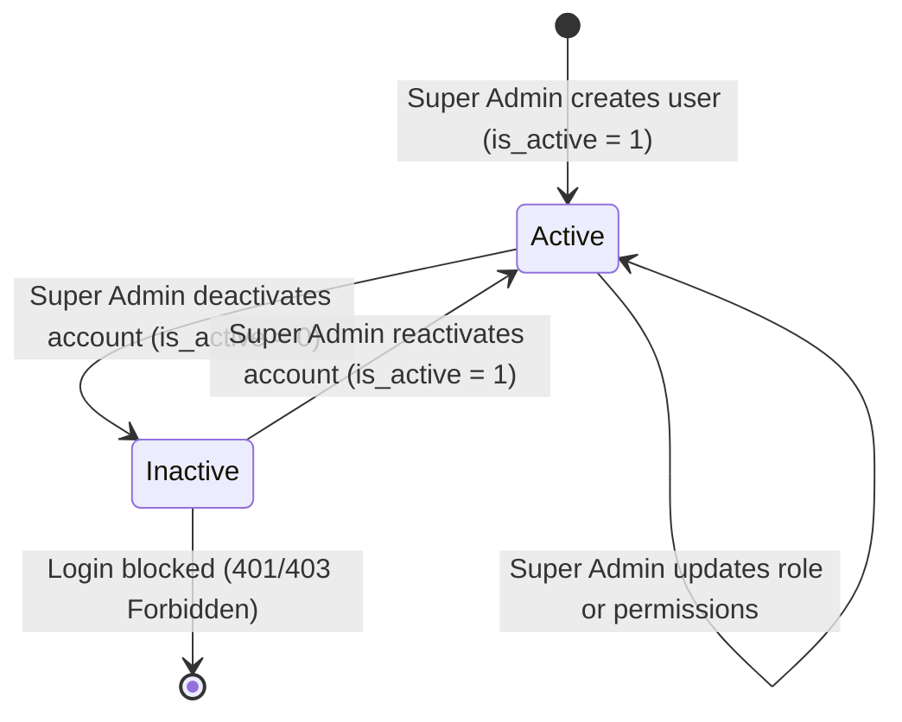

# Data Model: Admin Management & Role-Based Access Control (RBAC)

**Feature**: Admin Management & Role-Based Access Control (RBAC)  
**Feature Directory**: `specs/012-admin-rbac-management`  

---

## 1. Entities & Schemas

### User Entity (`auth_user` Table Extension)

Represents an application user with role-based authorization attributes.

```typescript
interface User {
  id: number;                   // Primary key
  username: string;             // Unique account username
  email: string;                // Account email address
  password?: string;            // Bcrypt or Django PBKDF2 hashed password
  role: 'super_admin' | 'price_admin' | 'presales_admin' | 'viewer'; // Assigned role
  permissions: string[];        // Array of granular permission strings e.g. ["ratecard:read", "boq:write"]
  is_active: number;            // 1 = Active (allowed to login), 0 = Deactivated/Blocked
  is_staff: number;             // 1 = Staff user flag
  is_superuser: number;         // 1 = Super Admin flag
  first_name?: string;          // User first name
  last_name?: string;           // User last name
  date_joined: string;          // ISO timestamp of user creation
  last_login?: string;          // ISO timestamp of last successful authentication
}
```

---

## 2. Role Definitions & Default Permission Mappings

```typescript
const ROLE_PERMISSIONS_MAP = {
  super_admin: [
    'admin:full',
    'ratecard:read',
    'ratecard:write',
    'ratecard:price_write',
    'boq:read',
    'boq:write',
    'reports:read'
  ],
  price_admin: [
    'ratecard:read',
    'ratecard:price_write'
  ],
  presales_admin: [
    'ratecard:read',
    'ratecard:write',
    'boq:read',
    'boq:write',
    'reports:read'
  ],
  viewer: [
    'ratecard:read',
    'boq:read',
    'reports:read'
  ]
};
```

---

## 3. Permission Catalog

- `admin:full`: Complete access to User Management (`/admin`) and system administration endpoints.
- `ratecard:read`: Permission to view ratecard items and directory search.
- `ratecard:write`: Permission to add new products, edit non-price metadata, upload bulk ratecard sheets.
- `ratecard:price_write`: Permission to edit buying prices, list prices, and apply global discounts.
- `boq:read`: Permission to view BOQ Generator quotes and saved quote summaries.
- `boq:write`: Permission to build, edit, save, and delete BOQ quotations.
- `reports:read`: Permission to view analytics dashboard and sales reports.

---

## 4. State Transitions


