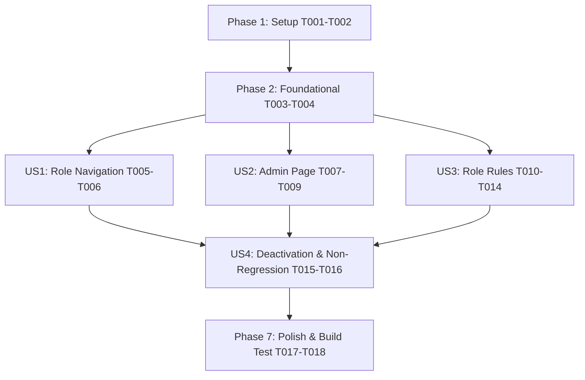

# Tasks: Admin Management & Role-Based Access Control (RBAC)

**Input**: Design documents from `specs/012-admin-rbac-management/`  
**Prerequisites**: plan.md (required), spec.md (required), research.md, data-model.md, contracts/, quickstart.md  
**Organization**: Grouped by user story for independent implementation and testing.

## Format: `[ID] [P?] [Story] Description`

- **[P]**: Can run in parallel (different files, no dependencies)
- **[Story]**: User story mapping (e.g. [US1], [US2], [US3], [US4])

---

## Phase 1: Setup (Shared Infrastructure & Database)

**Purpose**: Extend database profiles and define core RBAC constants and helper middleware

- [x] T001 Extend user schema in `backend/routes/auth.js` and database queries to return `role`, `permissions`, and `is_active` fields
- [x] T002 Create RBAC authorization middleware in `backend/middleware/rbac.js` exporting `requireRole` and `requirePermission` functions

---

## Phase 2: Foundational (Blocking Prerequisites)

**Purpose**: Update authentication context and client-side authorization helpers

**⚠️ CRITICAL**: Must be completed before user stories begin

- [x] T003 Update `AuthContext` and token handler in `frontend/src/App.jsx` to store user `role`, `permissions`, and `is_active` state
- [x] T004 Create frontend RBAC utility helpers (`hasRole`, `hasPermission`, `isSuperAdmin`, `isViewer`) in `frontend/src/utils/rbac.js`

**Checkpoint**: Foundation ready - Backend middleware and frontend RBAC helpers established.

---

## Phase 3: User Story 1 - Role-Based Navigation & Sidebar Control (Priority: P1) 🎯 MVP

**Goal**: Render "Admin" navigation option ONLY for Super Admin users and guard `/admin` route against unauthorized non-super-admin access.

**Independent Test**: Log in under Super Admin vs Price Admin vs Viewer credentials. Verify sidebar link visibility and route redirection behavior.

### Implementation for User Story 1

- [x] T005 [P] [US1] Add conditional "Admin" sidebar menu item with shield icon for `Super Admin` users in `frontend/src/components/Sidebar.jsx`
- [x] T006 [P] [US1] Create route authorization guard component `ProtectedRoute` in `frontend/src/components/ProtectedRoute.jsx` and wrap `/admin` route in `frontend/src/App.jsx`

**Checkpoint**: User Story 1 complete and testable independently.

---

## Phase 4: User Story 2 - Admin Management Page & User Operations (Priority: P1) 🎯 MVP

**Goal**: Create dedicated Admin Management page (`/admin`) allowing Super Admins to create users, select predefined roles, assign permission tags, edit existing users, and toggle account activation status.

**Independent Test**: Log in as Super Admin, open `/admin`, create a new user account, edit their role, toggle their active status to Inactive, and verify database persistence.

### Implementation for User Story 2

- [x] T007 [P] [US2] Implement Express REST API endpoints for user administration (`GET /api/admin/users`, `POST /api/admin/users`, `PUT /api/admin/users/:id`, `PATCH /api/admin/users/:id/status`) in `backend/routes/admin.js`
- [x] T008 [P] [US2] Create Admin Management directory table and header view in `frontend/src/pages/AdminManagement.jsx`
- [x] T009 [US2] Create User Form Modal with role dropdown and multi-select permission tag picker in `frontend/src/pages/AdminManagement.jsx`

**Checkpoint**: User Story 2 complete and testable independently.

---

## Phase 5: User Story 3 - Predefined Role Definitions & Permission Rules (Priority: P1)

**Goal**: Enforce 4 core predefined roles (`Super Admin`, `Price Admin`, `Pre-Sales Admin`, `Viewer`) across all frontend views and backend REST APIs.

**Independent Test**: Log in under each of the 4 roles and attempt write actions across Ratecard, BOQ Generator, and Reports views. Confirm `Viewer` role has read-only access and write API requests return `403 Forbidden`.

### Implementation for User Story 3

- [x] T010 [P] [US3] Enforce backend role/permission protection on Ratecard mutation endpoints (`POST /api/ratecard`, `PUT /api/ratecard/:id`, `DELETE /api/ratecard`, `POST /api/ratecard/upload`) in `backend/routes/ratecard.js`
- [x] T011 [P] [US3] Enforce backend role/permission protection on BOQ mutation endpoints (`POST /api/boq/save`, `DELETE /api/boq/:id`) in `backend/routes/boq.js`
- [x] T012 [P] [US3] Enforce read-only UI behavior for `Viewer` role (disable inline input editing) in `frontend/src/components/EditableCell.jsx`
- [x] T013 [P] [US3] Hide/disable action buttons ("Add Item", "Upload Sheet", "Wipe Catalog", "Apply Global Discount") for `Viewer` role in `frontend/src/pages/Ratecard.jsx`
- [x] T014 [US3] Hide/disable quote creation and deletion buttons for `Viewer` role in `frontend/src/pages/BOQGenerator.jsx` and `frontend/src/pages/Reports.jsx`

**Checkpoint**: User Story 3 complete and testable independently.

---

## Phase 6: User Story 4 - End-to-End RBAC Security & Non-Regression (Priority: P2)

**Goal**: Ensure deactivated users (`is_active = 0`) are blocked from authentication and active requests, maintaining 100% backward compatibility for all active pre-sales workflows.

**Independent Test**: Deactivate a user account, attempt authentication, and verify rejection with an inactive account message. Perform full end-to-end BOQ calculation and Excel export under valid roles.

### Implementation for User Story 4

- [x] T015 [P] [US4] Enforce active user status check (`is_active === 1`) during authentication and token validation in `backend/routes/auth.js`
- [x] T016 [US4] Verify session validation and token persistence for all active user roles in `frontend/src/App.jsx`

**Checkpoint**: All user stories functional and visually integrated.

---

## Phase 7: Polish & Cross-Cutting Concerns

**Purpose**: Final validation and production build verification

- [x] T017 [P] Run quickstart validation scenarios from `specs/012-admin-rbac-management/quickstart.md`
- [x] T018 Verify production build (`npm run build`) and confirm 0 console errors or security warnings

---

## Dependencies & Execution Order

### Parallel Opportunities

- **Foundational**: T003 (`App.jsx`) and T004 (`utils/rbac.js`) can run in parallel.
- **User Story 1**: T005 (`Sidebar.jsx`) and T006 (`ProtectedRoute.jsx`) can run in parallel.
- **User Story 2 & 3**: T007 (`backend/routes/admin.js`), T008 (`AdminManagement.jsx`), T010 (`ratecard.js`), T011 (`boq.js`), T012 (`EditableCell.jsx`), and T013 (`Ratecard.jsx`) target separate files and can proceed in parallel.
