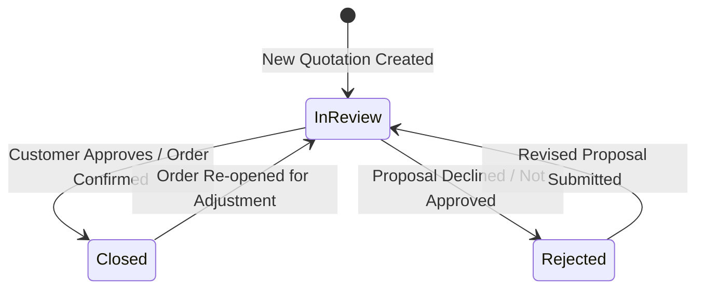

# Data Model: Reports Section Optimization and Feature Enhancement

## Core Data Entities

### 1. Quotation Report Summary Projection (`QuotationSummary`)
Represents the lightweight entity fetched for the Reports dashboard table and metrics, excluding line-item arrays.

| Field Name | Type | Description | Source Mapping |
|------------|------|-------------|----------------|
| `id` | integer | Unique quotation identifier | `exapp_boq.id` |
| `projectName` | string | Name of the project | `exapp_boq.project_name` |
| `projectLocation` | string | Geographic location of project | `exapp_boq.project_location` |
| `quotationNumber` | string | Document reference number | `exapp_boq.quotation_number` |
| `approach` | string | Sales channel (`si` or `direct`) | `exapp_boq.approach` |
| `solutionTitle` | string | Title of the solution package | `exapp_boq.solution_title` |
| `preparedBy` | string | User who generated quotation | `totals.preparedBy` / `exapp_boq.prepared_by` |
| `status` | string | Standardized status (`Closed`, `In Review`, `Rejected`) | Derived from `totals.approvalStatus` |
| `remarks` | string | Remarks/notes for non-approval or follow-up | `totals.remarks` |
| `salesTotal` | number | Total quoted sales revenue | `totals.grandTotalSales` / `totals.grand_sales_total` |
| `buyTotal` | number | Total product cost | `totals.grandTotalBuy` / `totals.grand_buy_total` |
| `profitTotal` | number | Calculated gross profit (`salesTotal` - `buyTotal`) | `totals.total_profit` / computed |
| `marginPercentage` | number | Profit margin percentage (`(profit / sales) * 100`) | Computed |
| `createdAt` | string (ISO-8601) | Creation timestamp | `exapp_boq.created_at` |

---

### 2. Time-Series Aggregates (`MonthlySalesMarginAggregate` & `YearlySalesMarginAggregate`)
Represent dynamic monthly/yearly buckets calculated on the client or server for chart rendering.

| Field Name | Type | Description |
|------------|------|-------------|
| `periodKey` | string | Period label (e.g., `2026-08` or `2026`) |
| `periodLabel` | string | Formatted display label (e.g., `Aug 2026` or `2026`) |
| `totalQuotedSales` | number | Sum of `salesTotal` for the period |
| `totalProfit` | number | Sum of `profitTotal` for the period |
| `averageMarginPercent` | number | Weighted margin percentage for the period |
| `quoteCount` | number | Total number of quotations in the period |

---

### 3. Quotation Status Breakdown Aggregate (`StatusDistributionAggregate`)
Summarizes overall quotation metrics grouped by the three target statuses.

| Status Category | Count Field | Sales Volume Field | Margin % Field |
|-----------------|-------------|--------------------|----------------|
| **Closed** | `closedCount` | `closedSales` | `closedAvgMargin` |
| **In Review** | `inReviewCount` | `inReviewSales` | `inReviewAvgMargin` |
| **Rejected** | `rejectedCount` | `rejectedSales` | `rejectedAvgMargin` |

---

## State Transition Rules for Quotation Status

