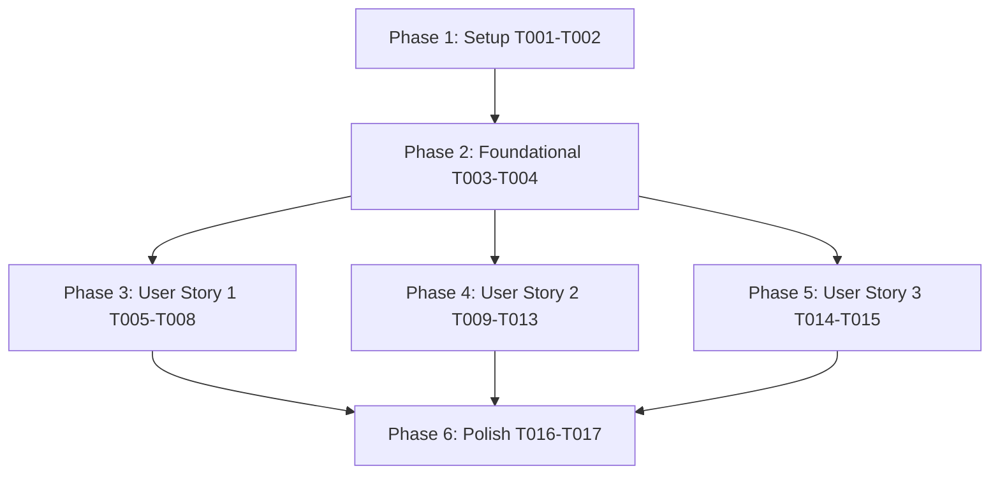

# Tasks: Reports Section Optimization and Feature Enhancement

**Input**: Design documents from `/specs/015-reports-section-enhancements/`  
**Prerequisites**: [`plan.md`](plan.md), [`spec.md`](spec.md), [`research.md`](research.md), [`data-model.md`](data-model.md), [`contracts/reports-api.md`](contracts/reports-api.md), [`quickstart.md`](quickstart.md)

---

## Format: `- [x] [ID] [P?] [Story?] Description with exact file path`

- **[P]**: Can run in parallel (different files, no dependencies)
- **[Story]**: Which user story this task belongs to (`[US1]`, `[US2]`, `[US3]`)
- Explicit file paths included for every task

---

## Phase 1: Setup (Shared Infrastructure)

**Purpose**: Route structure initialization and Express server registration

- [x] T001 Create backend reports router module in `backend/routes/reports.js`
- [x] T002 Mount `/api/reports` router in `backend/server.js`

---

## Phase 2: Foundational (Blocking Prerequisites)

**Purpose**: Core security, RBAC authorization middleware, and data normalization helpers required by all user stories

- [x] T003 [P] Implement authentication & RBAC authorization middleware checks (`verifyToken`, `requirePermission('reports:read')`, `requirePermission('boq:write')`) in `backend/routes/reports.js`
- [x] T004 [P] Implement row mapping & status normalization helpers (`Approved` $\rightarrow$ `Closed`, `Pending` $\rightarrow$ `In Review`, `Rejected` $\rightarrow$ `Rejected`) in `backend/routes/reports.js`

---

## Phase 3: User Story 1 - Quotation Performance & Management Dashboard Overview (Priority: P1) 🎯 MVP

**Goal**: Upgrade Reports section from a basic list into a complete management reporting dashboard with summary KPI cards, status distribution metrics, and monthly/yearly quoted sales & profit margin trend charts.

**Independent Test**: Navigate to `/reports`, select year/month filters, and verify summary KPI cards (Total Active Quotes, Quoted Sales Volume ₹, Est. Profit Margins ₹) and Recharts trend charts reflect data accurately.

- [x] T005 [P] [US1] Build backend summary metrics and dataset endpoint `GET /api/reports/summary` in `backend/routes/reports.js`
- [x] T006 [P] [US1] Create monthly and yearly sales volume & profit margin aggregate calculators in `frontend/src/pages/Reports.jsx`
- [x] T007 [US1] Render management dashboard KPI summary cards (Total Quotes, Combined Quoted Sales, Est. Profit Margins, Status counts) in `frontend/src/pages/Reports.jsx`
- [x] T008 [US1] Render interactive Recharts trend charts (Monthly/Yearly Sales & Margin) and Status Breakdown Donut chart in `frontend/src/pages/Reports.jsx`

---

## Phase 4: User Story 2 - Quotation Table with Status Tracking & Editable Remarks (Priority: P2)

**Goal**: Provide a detailed quotation log table with normalized status badges (`Closed`, `In Review`, `Rejected`), status selector dropdown, and an editable notes/remarks column for attaching rejection reasons, improvement feedback, and follow-up notes with server-side RBAC validation.

**Independent Test**: Update a quotation status to `Closed`/`In Review`/`Rejected` and edit notes column remark; confirm changes save to DB and persist after refresh, while unauthorized users are prevented from editing.

- [x] T009 [P] [US2] Implement RBAC-guarded status update endpoint `PATCH /api/reports/:id/status` in `backend/routes/reports.js`
- [x] T010 [P] [US2] Implement RBAC-guarded remarks/notes update endpoint `PATCH /api/reports/:id/remarks` in `backend/routes/reports.js`
- [x] T011 [P] [US2] Create normalized status selector component `frontend/src/components/CustomStatusDropdown.jsx` supporting `Closed`, `In Review`, and `Rejected` statuses
- [x] T012 [US2] Add editable Notes/Remarks column and inline note editor for rejection/improvement feedback in `frontend/src/pages/Reports.jsx`
- [x] T013 [US2] Integrate optimistic UI state updates and RBAC permission checks for status changes and remarks saving in `frontend/src/pages/Reports.jsx`

---

## Phase 5: User Story 3 - High-Performance Aggregated Reporting & Filtering (Priority: P3)

**Goal**: Optimize backend database queries using column projections to eliminate heavy line-item arrays and enable instant client-side multi-criteria filtering (<300ms).

**Independent Test**: Load Reports page (<1.5s initial load) and apply Year/Month/Status/Channel/Keyword filters instantly without refetching full datasets.

- [x] T014 [P] [US3] Optimize Supabase database query in `GET /api/reports/summary` (`backend/routes/reports.js`) using explicit column projections (`id`, `project_name`, `project_location`, `quotation_number`, `approach`, `solution_title`, `totals`, `created_at`)
- [x] T015 [US3] Implement memoized multi-criteria filter logic (`useMemo`) in `frontend/src/pages/Reports.jsx` for Year, Month, Status, Channel, and Keyword search

---

## Phase 6: Polish & Cross-Cutting Concerns

**Purpose**: Final audit, RBAC authorization testing, and end-to-end validation without affecting existing features.

- [x] T016 [P] Audit server-side RBAC permission enforcement across all report endpoints in `backend/routes/reports.js` and verify UI control disabling in `frontend/src/pages/Reports.jsx`
- [x] T017 Execute end-to-end quickstart validation scenarios defined in `specs/015-reports-section-enhancements/quickstart.md` to confirm zero regression on Auth, BOQ generator, and Product Catalog features

---

## Dependencies & Execution Order

---

## Parallel Execution Opportunities

- **Phase 2 Foundational**: T003 and T004 can be developed in parallel in `backend/routes/reports.js`.
- **Phase 3 (User Story 1)**: T005 (`GET /api/reports/summary` backend) and T006 (frontend aggregate math) can run in parallel.
- **Phase 4 (User Story 2)**: T009 (`PATCH /status` backend), T010 (`PATCH /remarks` backend), and T011 (`CustomStatusDropdown.jsx` component) can run in parallel.
- **Phase 5 (User Story 3)**: T014 (backend column projection optimization) can run in parallel with T015 (frontend `useMemo` multi-filter).

---

## Implementation Strategy & MVP Scope

1. **MVP Scope**: Complete Phase 1 (Setup), Phase 2 (Foundational), and Phase 3 (User Story 1). Validate management dashboard summary metrics and trend charts independently.
2. **Incremental Delivery**: Add Phase 4 (User Story 2) for status tracking & rejection feedback remarks management, then Phase 5 (User Story 3) for query optimization and memoized multi-filtering.
