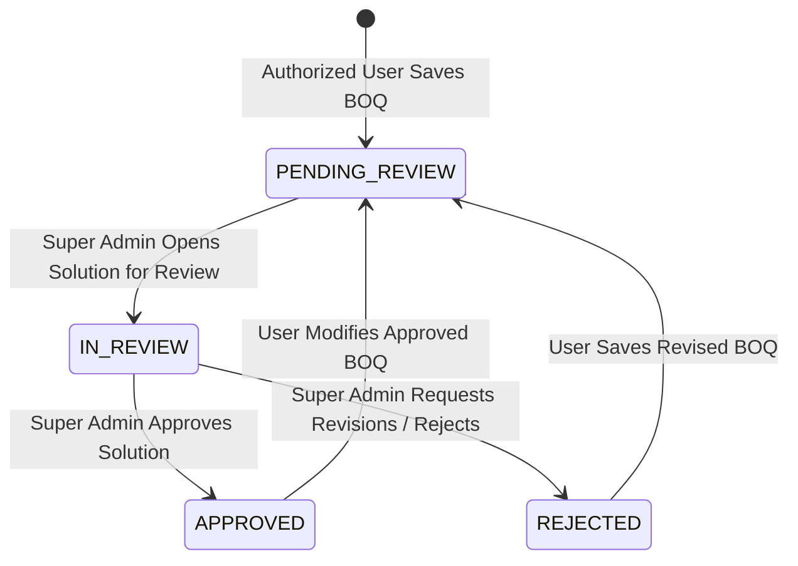

# Data Model: BOQ Save Email Notification & Super Admin Review

## Database Entities & Schema Modifications

### 1. BOQ Table Extensions (`exapp_boq`)

The existing `exapp_boq` table is extended with internal review management columns:

| Field Name | Data Type | Constraints / Default | Description |
|------------|-----------|-----------------------|-------------|
| `review_status` | VARCHAR(30) | DEFAULT `'PENDING_REVIEW'` | Internal review status (`PENDING_REVIEW`, `IN_REVIEW`, `APPROVED`, `REJECTED`) |
| `review_remarks` | TEXT | NULL | Internal review remarks/notes by Super Admin |
| `updated_at` | TIMESTAMPTZ | DEFAULT `now()` | Timestamp of last BOQ modification or review update |

---

### 2. Notifications Audit Table (`notifications`)

New relational audit table tracking all email dispatches and delivery statuses:

| Field Name | Data Type | Constraints | Description |
|------------|-----------|-------------|-------------|
| `id` | BIGSERIAL | PRIMARY KEY | Unique notification audit log ID |
| `boq_id` | INTEGER | REFERENCES `exapp_boq(id)` ON DELETE CASCADE | Associated BOQ quotation ID |
| `event_id` | VARCHAR(255) | UNIQUE, NOT NULL | Unique client-generated event UUID for deduplication |
| `recipient` | TEXT | NOT NULL | Target Super Admin email address(es) |
| `notification_type` | VARCHAR(50) | NOT NULL | Type of event (`BOQ_CREATED`, `BOQ_UPDATED`) |
| `status` | VARCHAR(20) | NOT NULL | Dispatch status (`SENT` or `FAILED`) |
| `sent_at` | TIMESTAMPTZ | NULL | Timestamp when email was successfully sent |
| `created_at` | TIMESTAMPTZ | DEFAULT `now()` | Timestamp when notification record was created |
| `error_message` | TEXT | NULL | Error details if SMTP dispatch failed |

---

## State Transition Diagrams

### Internal Review Status State Machine

