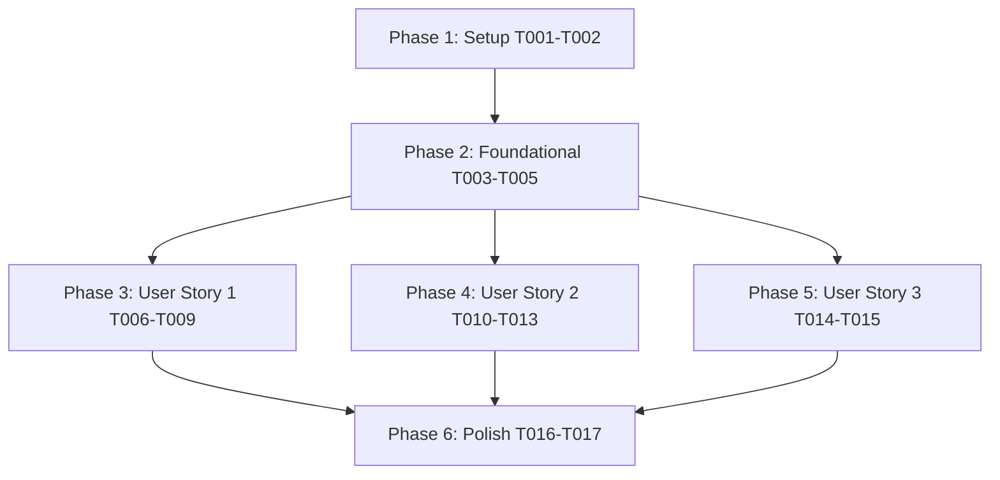

# Tasks: BOQ Save Email Notification & Super Admin Review

**Input**: Design documents from `/specs/016-boq-email-notification-review/`  
**Prerequisites**: [`plan.md`](plan.md), [`spec.md`](spec.md), [`research.md`](research.md), [`data-model.md`](data-model.md), [`contracts/notifications-api.md`](contracts/notifications-api.md), [`quickstart.md`](quickstart.md)

---

## Format: `- [x] [ID] [P?] [Story?] Description with exact file path`

- **[P]**: Can run in parallel (different files, no dependencies)
- **[Story]**: Which user story this task belongs to (`[US1]`, `[US2]`, `[US3]`)
- Explicit file paths included for every task

---

## Phase 1: Setup (Shared Infrastructure)

**Purpose**: Package installation and environment configuration

- [x] T001 Install `nodemailer` dependency in `backend/package.json`
- [x] T002 Configure Gmail SMTP credentials (`SMTP_HOST`, `SMTP_PORT`, `SMTP_SECURE`, `SMTP_USER`, `SMTP_PASSWORD`, `EMAIL_FROM`) in `backend/.env` and `backend/.env.example`

---

## Phase 2: Foundational (Blocking Prerequisites)

**Purpose**: Core email service, notification audit logger, and database schema helper required by all user stories

- [x] T003 [P] Create Nodemailer SMTP transporter singleton service in `backend/services/emailService.js`
- [x] T004 [P] Create notification audit logging & Super Admin email query service in `backend/services/notificationService.js`
- [x] T005 [P] Create schema helper for `review_status`, `review_remarks`, `updated_at` extensions on `exapp_boq` and table `notifications` in `backend/utils/initNotificationsDb.js`

---

## Phase 3: User Story 1 - Automated BOQ Save Email Notification (Priority: P1) 🎯 MVP

**Goal**: Trigger Nodemailer email notification to Super Admins on BOQ save with client `event_id` deduplication.

**Independent Test**: Save a BOQ quote as Pre-Sales Admin or Price Admin, verify email received by Super Admin and audit row inserted in `notifications` table.

- [x] T006 [P] [US1] Generate client `event_id` UUID on save requests in `frontend/src/pages/BOQGenerator.jsx`
- [x] T007 [US1] Integrate notification trigger `sendBoqSaveNotification` into `POST /api/boq/save` in `backend/routes/boq.js`
- [x] T008 [US1] Implement HTML & plain text email template renderer ("New BOQ Created - Review Required" / "BOQ Updated - Review Required") in `backend/services/emailService.js`
- [x] T009 [US1] Implement `event_id` deduplication verification in `backend/services/notificationService.js`

---

## Phase 4: User Story 2 - Super Admin Review Panel & Internal Status Management (Priority: P2)

**Goal**: Provide a notification & review panel in Super Admin dashboard to inspect notifications and update internal review status (`PENDING_REVIEW`, `IN_REVIEW`, `APPROVED`, `REJECTED`) and remarks.

**Independent Test**: Open Super Admin dashboard, review pending BOQ, change review status to APPROVED/REJECTED with remarks, and verify internal review status persists.

- [x] T010 [P] [US2] Create notification audit log query endpoint `GET /api/admin/notifications` in `backend/routes/admin.js`
- [x] T011 [P] [US2] Create internal review status & remarks update endpoint `PATCH /api/admin/boq/:id/review` in `backend/routes/admin.js`
- [x] T012 [US2] Render Super Admin Notification & BOQ Review Panel in `frontend/src/pages/AdminManagement.jsx`
- [x] T013 [US2] Connect review status selector and remarks modal form in `frontend/src/pages/AdminManagement.jsx`

---

## Phase 5: User Story 3 - RBAC Security & Notification Failure Resilience (Priority: P3)

**Goal**: Enforce backend RBAC checks blocking Read-Only users, and isolate SMTP errors so BOQ database saves succeed even if email dispatch fails.

**Independent Test**: Save BOQ as Read-Only user (verifying HTTP 403) and test invalid SMTP credentials (verifying BOQ save succeeds while notification audit status is `FAILED`).

- [x] T014 [P] [US3] Wrap notification execution in non-blocking try-catch inside `POST /api/boq/save` (`backend/routes/boq.js`), logging status `FAILED` in `notifications` table without rolling back committed BOQ database saves
- [x] T015 [US3] Audit RBAC authorization checks (`verifyToken`, `requirePermission('boq:write')`, `requireRole('super_admin')`) across all BOQ save and review endpoints in `backend/routes/boq.js` and `backend/routes/admin.js`

---

## Phase 6: Polish & Cross-Cutting Concerns

**Purpose**: Final documentation audit and end-to-end validation without affecting existing features.

- [x] T016 [P] Document SMTP environment variable configuration for local and Render production deployments in `backend/.env.example` and `README.md`
- [x] T017 Execute end-to-end quickstart validation scenarios defined in `specs/016-boq-email-notification-review/quickstart.md` to confirm zero regression on Auth, BOQ generator, Reports, and Product Catalog features

---

## Dependencies & Execution Order

---

## Parallel Execution Opportunities

- **Phase 2 Foundational**: T003 (`emailService.js`), T004 (`notificationService.js`), and T005 (`initNotificationsDb.js`) can be developed in parallel.
- **Phase 3 (User Story 1)**: T006 (`BOQGenerator.jsx` UUID generation) can run in parallel with T008 (`emailService.js` HTML template).
- **Phase 4 (User Story 2)**: T010 (`GET /api/admin/notifications`) and T011 (`PATCH /api/admin/boq/:id/review`) can run in parallel.
- **Phase 5 (User Story 3)**: T014 (non-blocking notification failure isolation) can run in parallel with T015 (RBAC audit).

---

## Implementation Strategy & MVP Scope

1. **MVP Scope**: Complete Phase 1 (Setup), Phase 2 (Foundational), and Phase 3 (User Story 1). Validate automated Nodemailer Gmail email notifications on BOQ save independently.
2. **Incremental Delivery**: Add Phase 4 (User Story 2) for Super Admin notification & BOQ review panel, then Phase 5 (User Story 3) for failure isolation and RBAC security verification.
